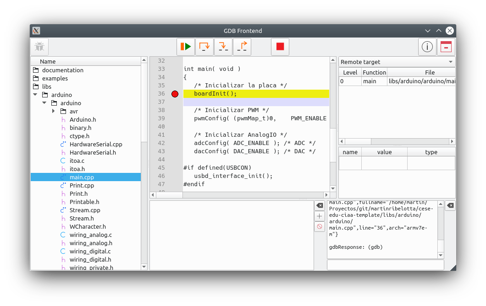
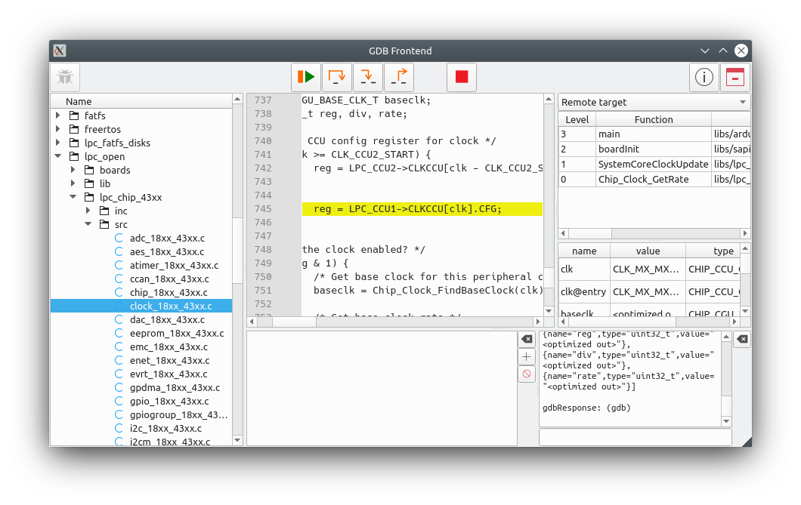
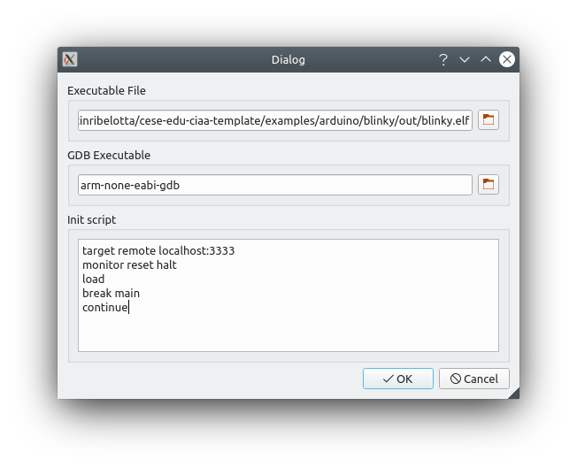

# GDB Front-end

This project implements a GDB front-end using Qt libraries (plus QScintilla)

The main goal is to provide playground of gdb-mi front-end for integration into [embedded-ide project](https://github.com/martinribelotta/embedded-ide)

### License

```
    Copyright (C) 2020 Martin Alejandro Ribelotta <martinribelotta@gmail.com>

    This program is free software: you can redistribute it and/or modify
    it under the terms of the GNU General Public License as published by
    the Free Software Foundation, either version 3 of the License, or
    (at your option) any later version.

    This program is distributed in the hope that it will be useful,
    but WITHOUT ANY WARRANTY; without even the implied warranty of
    MERCHANTABILITY or FITNESS FOR A PARTICULAR PURPOSE.  See the
    GNU General Public License for more details.

    You should have received a copy of the GNU General Public License
    along with this program.  If not, see <https://www.gnu.org/licenses/>.
```

### Features

- Parametrized launcher with init commands
- Auto-detect `.gdbinit` content
- Step/Next/Continue/Pause
- Source view (via read only QScintilla)
- Source tree explorer with file auto-discover
- Thread view
- Stack trace view
- Local variable viewer
- Data watch points (**TODO**)
- Insert/Delete breakpoint by line
- GDB command line

### Screenshots





